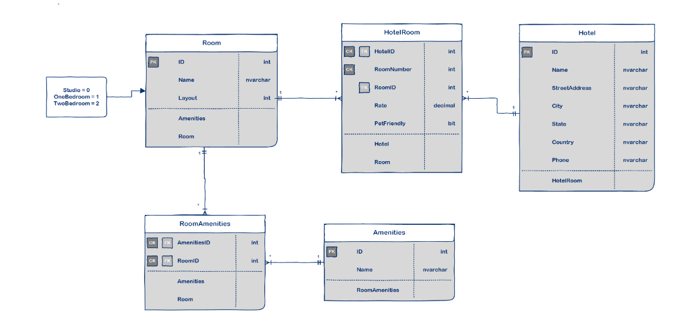

# Async-InnApp

## Introduction
Async-Inn-App is a .NET Core Web Application designed to create an API server. API services within this application provide a way for the application to communicate with a server-side system in order to retrieve and update data. API as a Service refers to a platform or tool that assists in the creation and deployment of API services. By utilizing EF Core (Entity Framework), developers can leverage an object-relational mapper (O/RM) that enables them to interact with a database using .NET objects. This eliminates the need for writing extensive data-access code typically required in such scenarios.
## Async-Inn Hotel database ERD diagram


## Packages and Tools

Create a new Empty .NET Core Web Application Setup Entity Framework Install the Entity Framework Dependencies for your app

 1-From Manage NuGet Packages Add:

- Microsoft.EntityFrameworkCore.SqlServer

- Microsoft.EntityFrameworkCore.Tools

2-Install ef command line tool

-From a terminal

- dotnet tool install --global dotnet-ef


## Data Models and SQL Tables
Tell now this project have 3 models present database table for the database digram


Hotel Class : Hotels: Hotels can have multiple rooms and are connected to those rooms through the HotelRoom table.
```b
public class Hotel
    {
        public int Id { get; set; }
        public string Name { get; set; }
        public string StreetAddress { get; set; }
        public string City { get; set; }
        public string State { get; set; }
        public string Country { get; set; }
        public string Phone { get; set; }
    }
```

Room Class : Rooms are not specific rooms, but more like room types. Thus, a Hotel can have multiple Rooms, and a Room can belong to many Hotel locations. Rooms are related to Hotels through the HotelRoom table.
```b public class Room
    {
        public int Id { get; set; }
        public string Name { get; set; }
        public int Layout { get; set; }
    }
 ```
Amenity Class : The Amenities table holds room features like AC, Coffee maker, etc. An amenity type can belong to many different rooms, and a room can have many different amenities. This many:many relationship is captured in the RoomAmenities join table.
```b  public class Amenity
    {
        public int Id { get; set; }
        public string Name { get; set; }
    }
```


## Seeding data
Seed data is data that you populate the database with at the time it is created. You use seeding to provide initial values for lookup lists.

-Add default data for all three of your simple models

-Hotels seed data

```b modelBuilder.Entity<Hotel>().HasData(
                   new Hotel() {Id=1 , Name= "Async Inn" , City="Paris" , Country ="France" , State =" Paris" , StreetAdress = "Paris-France" , Phone ="00560078"},
                   new Hotel() {Id=2 , Name= "Async Inn" , City="Amman" , Country ="Jordan" , State =" Amman" , StreetAdress = "DownTawn" , Phone ="00962788996677"},
                   new Hotel() {Id=3 , Name= "Async Inn" , City="Qairo" , Country ="Egypt" , State ="Qairo" , StreetAdress = "SalahSalem" , Phone ="0156005098"}
                );
```


- Rooms seed data

```b
            modelBuilder.Entity<Room>().HasData(
              new Room() { Id = 1, Name = "RainTrain", layout = 2 },
              new Room() { Id = 2, Name = "GreenForest", layout = 1 },
              new Room() { Id = 3, Name = "RainTrain", layout = 3 }
            );

```

   -Amenities seed data

```b
            
            modelBuilder.Entity<Amenities>().HasData(
                new Amenities() { Id=1, Name="Ac"},
                new Amenities() { Id=2, Name="CoffeMaker"},
                new Amenities() { Id=3, Name="Sawna"}
                );
 ```


We add controller folder and in we creat classes called controller for each entity 

HotelController

     [Route("api/[controller]")]
    [ApiController]
    public class HotelsController : ControllerBase
    {
        private readonly HotelDbContext _context;

        public HotelsController(HotelDbContext context)
        {
            _context = context;
        }

        // GET: api/Hotels
        [HttpGet]
        public async Task<ActionResult<IEnumerable<Hotel>>> Gethotel()
        {
          if (_context.hotel == null)
          {
              return NotFound();
          }
            return await _context.hotel.ToListAsync();
        }

        // GET: api/Hotels/5
        [HttpGet("{id}")]
        public async Task<ActionResult<Hotel>> GetHotel(int id)
        {
          if (_context.hotel == null)
          {
              return NotFound();
          }
            var hotel = await _context.hotel.FindAsync(id);

            if (hotel == null)
            {
                return NotFound();
            }

            return hotel;
        }

        // PUT: api/Hotels/5
        // To protect from overposting attacks, see https://go.microsoft.com/fwlink/?linkid=2123754
        [HttpPut("{id}")]
        public async Task<IActionResult> PutHotel(int id, Hotel hotel)
        {
            if (id != hotel.Id)
            {
                return BadRequest();
            }

            _context.Entry(hotel).State = EntityState.Modified;

            try
            {
                await _context.SaveChangesAsync();
            }
            catch (DbUpdateConcurrencyException)
            {
                if (!HotelExists(id))
                {
                    return NotFound();
                }
                else
                {
                    throw;
                }
            }

            return NoContent();
        }

        // POST: api/Hotels
        // To protect from overposting attacks, see https://go.microsoft.com/fwlink/?linkid=2123754
        [HttpPost]
        public async Task<ActionResult<Hotel>> PostHotel(Hotel hotel)
        {
          if (_context.hotel == null)
          {
              return Problem("Entity set 'HotelDbContext.hotel'  is null.");
          }
            _context.hotel.Add(hotel);
            await _context.SaveChangesAsync();

            return CreatedAtAction("GetHotel", new { id = hotel.Id }, hotel);
        }

        // DELETE: api/Hotels/5
        [HttpDelete("{id}")]
        public async Task<IActionResult> DeleteHotel(int id)
        {
            if (_context.hotel == null)
            {
                return NotFound();
            }
            var hotel = await _context.hotel.FindAsync(id);
            if (hotel == null)
            {
                return NotFound();
            }

            _context.hotel.Remove(hotel);
            await _context.SaveChangesAsync();

            return NoContent();
        }

        private bool HotelExists(int id)
        {
            return (_context.hotel?.Any(e => e.Id == id)).GetValueOrDefault();
        }

Repository Design Pattern

The Repository Design Pattern its Mediates between the domain and the data mapping layers using a collection-like interface for accessing the domain objects.

In other words, we can say that a Repository Design Pattern acts as a middleman or middle layer between the rest of the application and the data access logic.

Here we have three layer Interfaces for all CRUD operations :

IHotel interface


        //create
        Task<Hotel> Create(Hotel hotel);

        //get all
        Task<List<Hotel>> GetHotels();

        // get hotel by id
        Task<Hotel> GetHotel(int id);

        // update
        Task<Hotel> UpdateHotel(int id, Hotel hotel);

        //delete
        Task DeleteHotel(int id);
IRoom interface


        
        Task<Room> Create (Room room);

        Task<List<Room>> GetRooms();

        Task<Room> GetRoom(int id);

        Task<Room> UpdateRoom(int id, Room room);

        Task DeleteRoom(int id);
IAmenitie interface


          Task<Amenities> Create(Amenities amenities);

        Task<List<Amenities>> GetAmenities();

        Task<Amenities> GetAmenity(int id);

        Task<Amenities> UpdateAmenities(int id, Amenities amenities);

        Task DeleteAmenities(int id);

Then add a folder and create init calasses to implement the all interfaces there is an example 

HotelServices

    private readonly HotelDbContext _context;

        public HotelServices(HotelDbContext context)
        {
            _context = context;
        }
        public async Task<Hotel> Create(Hotel hotel)
        {
            _context.hotel.Add(hotel);
            await _context.SaveChangesAsync();
            return hotel;
        }

        public async Task DeleteHotel(int id)
        {
            Hotel hotel = await GetHotel(id);

            _context.Entry(hotel).State = EntityState.Detached;

            await _context.SaveChangesAsync();

        }

        public async Task<Hotel> GetHotel(int id)
        {
            Hotel hotel = await _context.hotel.FindAsync(id);
            return hotel;
        }

        public async Task<List<Hotel>> GetHotels()
        {
            var hotels = await _context.hotel.ToListAsync();
            return hotels;
        }

        public async Task<Hotel> UpdateHotel(int id, Hotel hotel)
        {
            _context.Entry(hotel).State=EntityState.Modified;
            await _context.SaveChangesAsync();
            return hotel;

        }

Then in all controller we change the method to be like this for all entity

HotelController

       private readonly IHotel _hotel;

        public HotelsController(IHotel hotel)
        {
            _hotel = hotel;
        }

        // GET: api/Hotels
        [HttpGet]
        public async Task<ActionResult<IEnumerable<Hotel>>> Gethotel()
        {

            return await _hotel.GetHotels();
        }

        // GET: api/Hotels/5
        [HttpGet("{id}")]
        public async Task<ActionResult<Hotel>> GetHotel(int id)
        {
          var hotel = await _hotel.GetHotel(id);
            return hotel;

            
        }

        // PUT: api/Hotels/5
        // To protect from overposting attacks, see https://go.microsoft.com/fwlink/?linkid=2123754
        [HttpPut("{id}")]
        public async Task<IActionResult> PutHotel(int id, Hotel hotel)
        {
            if (id != hotel.Id)
            {
                return BadRequest();
            }
             var updatedhotel = await _hotel.UpdateHotel(id,hotel);
             return Ok(updatedhotel);

                  }

        // POST: api/Hotels
        // To protect from overposting attacks, see https://go.microsoft.com/fwlink/?linkid=2123754
        [HttpPost]
        public async Task<ActionResult<Hotel>> PostHotel(Hotel hotel)
        {
            await _hotel.Create(hotel);

            return CreatedAtAction("GetHotel", new { id = hotel.Id }, hotel);
        }

        // DELETE: api/Hotels/5
        [HttpDelete("{id}")]
        public async Task<IActionResult> DeleteHotel(int id)
        {
            await _hotel.DeleteHotel(id);
            return NoContent();
        }

       

Finlly need to add services for all layers in Program.cs class

            services.AddTransient<IHotel, HotelServices>();
            services.AddTransient<IRoom, RoomServices>();
            services.AddTransient<IAmenitie, AmenitieServices>();
